# Лаба 1 – Git

В этой лабораторной работе мы научимся базой работе с системой контроля версий Git.

Git представляет из себя утилиту для командной строки, которая называется `git`.

# Что нужно сделать к защите

1. Создать локальный git репозиторий с пустым файлом `README.md`;
2. Сделать первый коммит в ветку `main`;
3. Добавить удалённый **приватный** репозиторий на хостинге [GitHub](https://github.com) (или любом другом, как вам удобнее);
4. Запушить локальные коммиты в удалённый репозиторий по протоколу **https**;
5. Создать от ветки `main` ветку `hotfix/task1`;
6. Добавить в `README.md` строку, в которой содержится ваше **ФИО и номер группы**;
7. Через командную строку сделать коммит, указав **в качестве сообщения ФИО и номер группы**;
8. Запушить ветку `hotfix/task1` в удаленный репозиторий;
9. Слить изменения, сделанные в ветке `hotfix/task1` в ветку `main`;
10. Запушить ветку `main` в удаленный репозиторий;

К защите нужно иметь репозиторий на (как вариант) [GitHub](https://github.com), в котором будет две ветки: `main` и `hotfix/task1`. 
В ветке`main` должно быть два коммита (самый первый и тот, что был добавлен в рамках `hotfix/task1`).

# Вопросы к защите

Я буду задавать вопросы (1-2) из списка, однако могу дополнительно спросить (исключительно) по содержанию практики.

Если ответить не получилось - в рамках того же занятия сможете освежить свои знания и подойти чуть позже.

1. Что такое Git и для чего он используется?
2. Что такое коммит в Git?
3. Чем рабочая директория отличается от индекса (staging area) и от коммитов?
4. Зачем нужен `git add`, можно ли сразу сделать коммит?
5. Что показывает команда `git status`?
6. Что такое ветка в Git и зачем нужны ветки?
7. Как слить изменения из одной ветки в другую? Как будет выглядеть история коммитов веток?
8. Что такое remote в Git?
9. Чем `git fetch` отличается от `git pull`?
10. Что делает `git push`? Что будет, если изменить ветку локально, но не запушить?
11. Зачем при первом `git push` новой ветки указывают флаг `-u`?
12. Что такое Pull Request? Чем он отличается от обычного `git merge`?
13. На GitHub в веб-интерфейсе создали ветку и добавили файл. Как получить эти изменения у себя локально?

# Практика

## Установка

На Linux `git` должен быть установлен изначально, но если у вас другая операционная система 
или его нет по какой-то причине на вашей машине нет, то необходимо его установить.

Гайд по установке: [https://git-scm.com/downloads](https://git-scm.com/downloads)

Если нужны более подробные инструкции по установке, открывайте спойлер ниже:

[https://youtu.be/ipBOEo5fWKw?si=_PcLoNRsX2WxYftY](https://youtu.be/ipBOEo5fWKw?si=_PcLoNRsX2WxYftY)

 

## Работа с гитом

### Создание локального репозитория

Работать с гитом будет в проекте со следующей структурой:

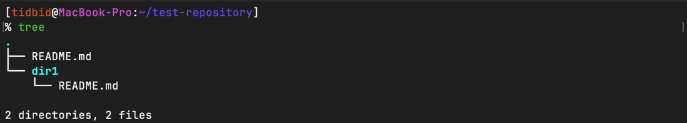
Структура проекта

Если раньше вы не работали с консолью, полезно будет заглянуть под спойлер ниже:

[Работа с windows cmd](https://youtu.be/LtZpdRJvU1A?si=0cI9BN9oQAq3TDaQ)

[Работа с git bash](https://youtu.be/ipBOEo5fWKw?si=K7UkIhYzqebSNgIH&t=481)

 

При попытке выполнения `git` команд в таком проекте будет выдана ошибка, так как он пока не является git-репозиторием:

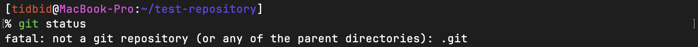
Ошибка при выполнении `git status`

Для инициализации репозитория нужно воспользоваться командой `git init`, 
которая создаст в текущей директории git-репозиторий.
Git-репозиторий на самом деле представляет собой скрытую папку 
.git - внутреннее хранилище объектов и метаданных, которым пользуется Git)

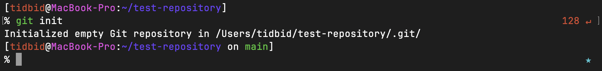
Инициализация репозитория `git`

Теперь посмотрим, какой статус имеет каждый файл в проекте. Так как мы пока не добавляли файлы в индекс (staging area)
и не коммитили, их статус будет untracked (гит впервые слышит о таких файлах). Для этого выполним команду `git status`:

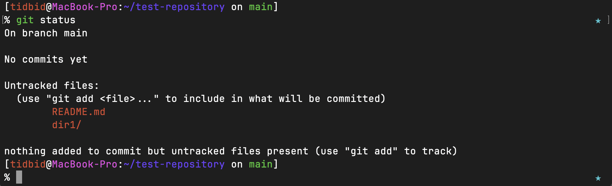
Результат выполнения команды `git status`

Данная команда также показывает нам, что мы находимся в ветке main - 
она является веткой по умолчанию, которую гит создает сам при инициализации репозитория.

Отлично, теперь добавим все файлы проекта в индекс, чтобы они были добавлены в будущий коммит, 
это делаем при помощи команды `git add .` (точка в конце указывает, что нужно добавить все файлы, альтернативно можно перечислять названия файлов по отдельности):

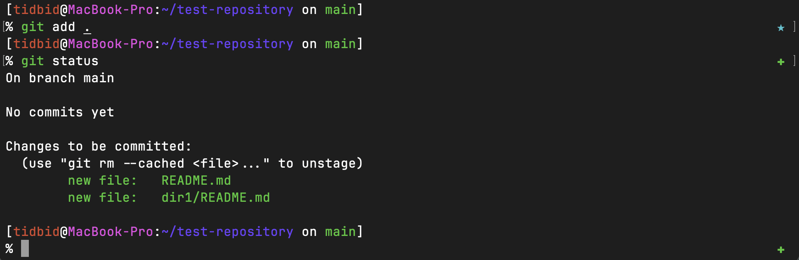
Результат выполнения команды `git add .` - все изменённые файлы были добавлены в индекс, что можно увидеть выполнив команду `git status`.

Перед тем, как коммитить добавим информацию о себе: имя и почту. 
Это полезно в реальных проектах, потому что сразу видно и понятно, кто какие изменения делал.
Для этого существует команда `git config`, с помощью которой можно изменять параметры конфигурации гита:

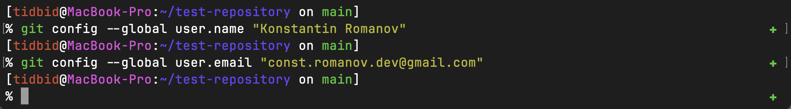
Добавляем информацию о себе

Создадим свой первый коммит: для этого используем команду `git commit`, 
в качестве аргумента `-m` важно передать сообщение коммита, поясняющее, что было сделано, 
в данном случае `"Initial commit"`:

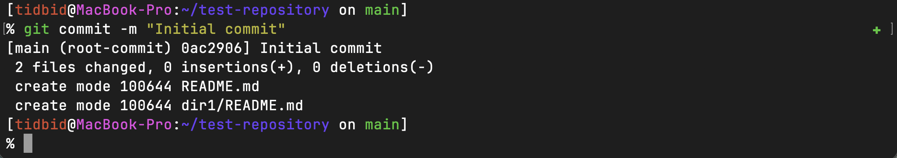
Создание первого коммита

Посмотрим историю коммитов в ветке `main` при помощи комманды `git log`: 

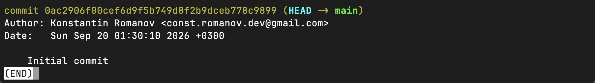
История коммитов в ветке main

Отлично! Теперь у нас есть полностью функционирующий локальный репозиторий со стабильной версией нашего проекта.

### Создание удаленного репозитория

Теперь пришло самое время создать удаленный репозиторий. Для этого будем использовать платформу [GitHub](https://github.com). Вы можете использовать любую другую платформу, в целом интерфейс везде аналогичен, однако инструкции будут именно по GitHub.

После регистрации на платформе переходим на вкладку *Repositories* и жмем кнопку *New*:

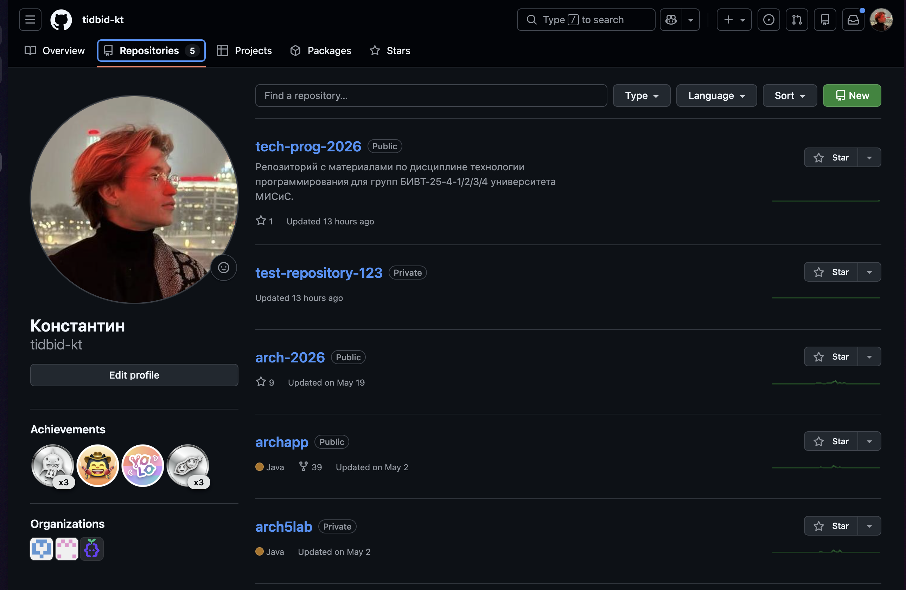
Нажимать на *New*

Заполняем информацию о проекте (обратите внимание на настройки публичности проекта, важно сделать его **приватным**). README, .gitignore и license при создании лучше не добавлять — у нас уже есть локальный репозиторий:

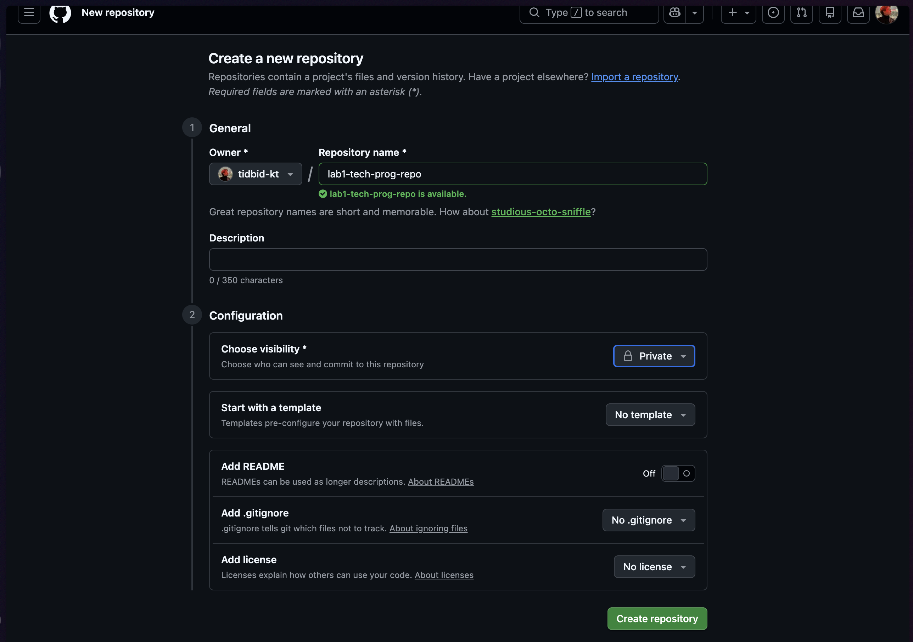
Заполнять вот это

### Синхронизация репозиториев

Отлично! Проект создан, теперь давайте синхронизировать его с нашим локальным репозиторием. 
Для этого нам понадобится скопировать HTTPS-ссылку:

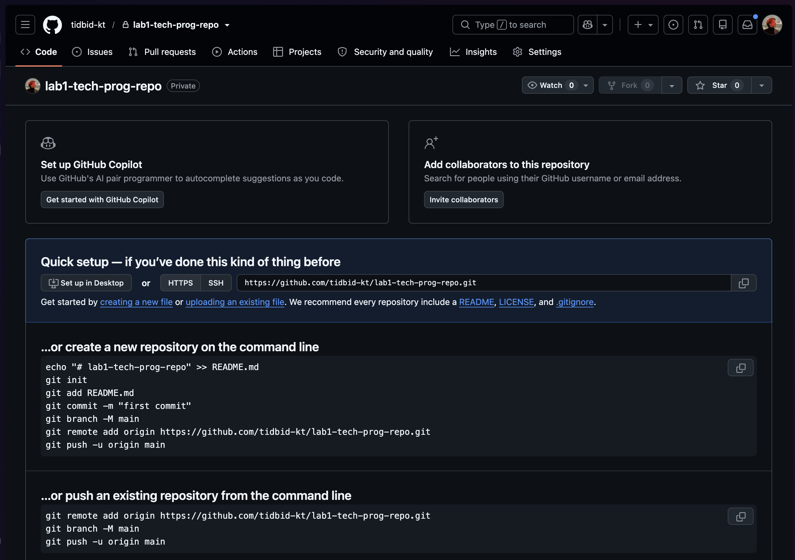

> **_NOTE:_** Синхронизацию будем выполнять по протоколу **HTTPS**.
> Обычно GitHub предложит войти **в браузере** (через Git Credential Manager) либо попросить **Personal Access Token (PAT)** вместо пароля.
> Как выписать токен: [инструкция](https://docs.github.com/ru/authentication/keeping-your-account-and-data-secure/managing-your-personal-access-tokens).
> После получения токена вводите его в графу пароля, username ваш, стандартный.
>
> Альтернативно можно использовать SSH ссылку, но для этого нужно настроить ssh-ключ
> ([инструкция](https://habr.com/ru/articles/1006970/)).

Дальше нужно добавить в локальный репозиторий данные об удалённом репозитории при помощи команды `git remote`, 
для которой указываем ник-нейм для удаленного репозитория (`origin`) и ссылку на него (ту, что мы скопировали ранее):

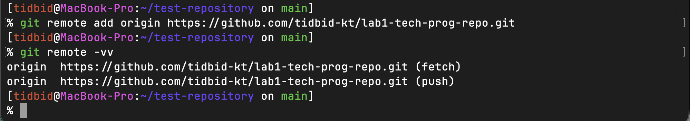
Добавляем удалённый репозиторий

Просмотреть добавленные репозитории можно командой `git remote`, если добавить к ней флаг `-vv`.

Теперь можем наконец-то пушить! Это сделаем командой `git push` 
(при первом пуше GitHub может попросить войти в браузере или ввести PAT):

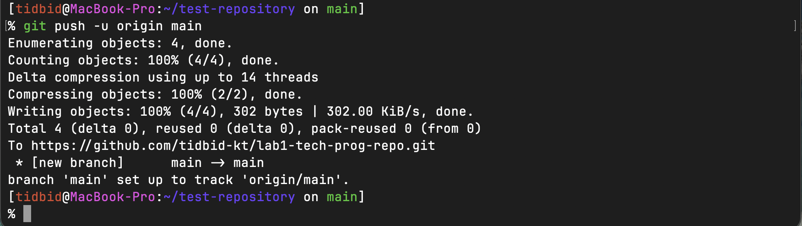
Пуш в удалённый репозиторий

Флаг `-u` подсказывает гиту, что ветку надо связать с удаленным репозиторием, 
`origin` указывает на то, в какой именно удаленный репозиторий мы пушим, 
`main` указывает на название ветки в удаленном репозитории, в которую идут изменения (если такой нет, она будет создана автоматически).

Теперь в веб интерфейсе должны появиться файлы нашего репозитория. И действительно, вот они:

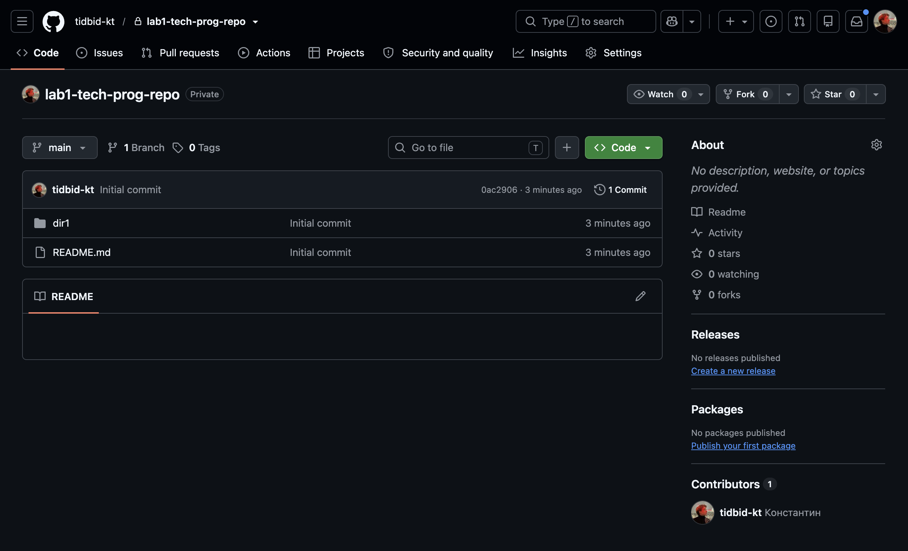
Результат

### Слияние веток

Теперь давайте разберемся с тем, как работает модель ветвления Git.

Попробуем поработать с Git из UI платформы, давайте добавим в README.md немного текста, а то сейчас он выглядит довольно пресно.
Для этого в веб-интерфейсе нужно кликнуть по названию файла:

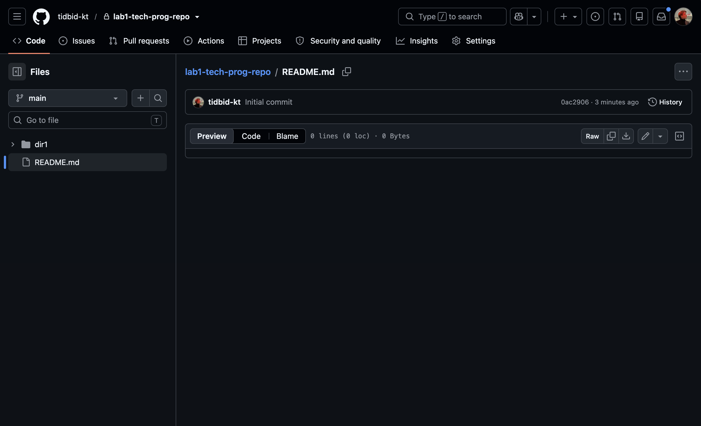
Куда кликать

На странице файла видим содержимое. Теперь давайте его редактировать — кликать надо по иконке карандаша (*Edit*):

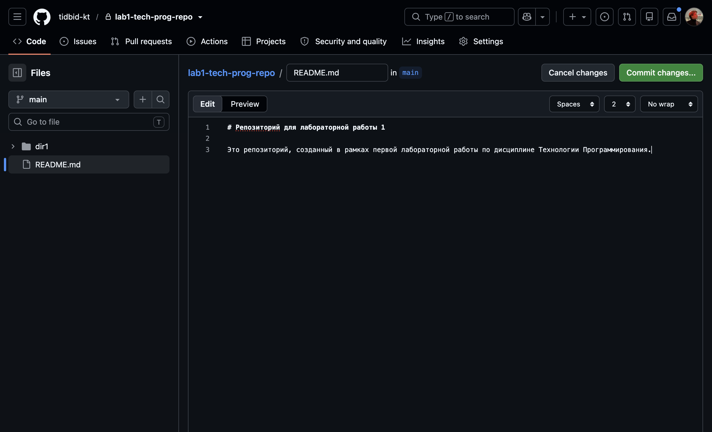
Сюда кликать

Отлично, должен открыться редактор. Наполняем файлик описанием проекта и коммитим изменения.
Жмём *Commit changes...* и в появившемся окошке указываем новую ветку — например `hotfix/md-content`:

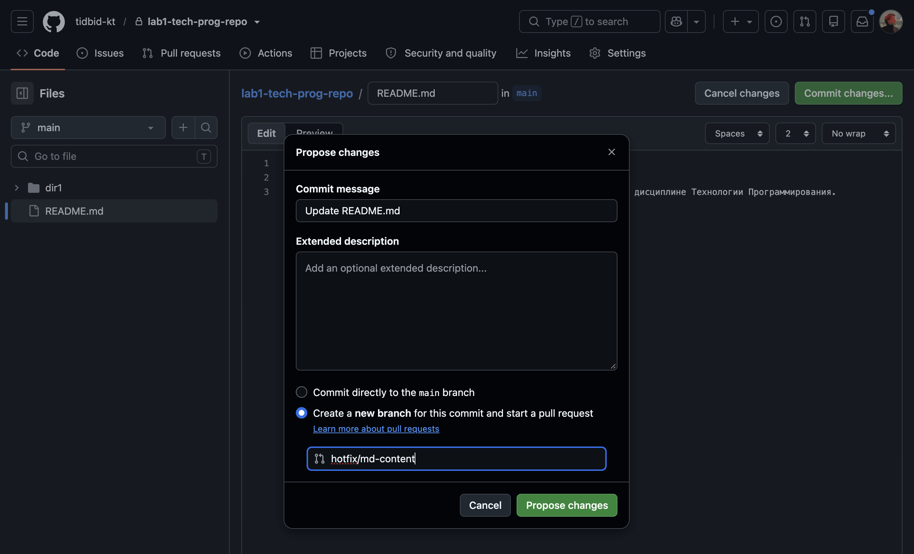
Коммитим наш супер хотфикс

После этого GitHub сразу предложит создать **Pull Request (PR)** — по сути просьбу влить изменения из нашей ветки в другую прямо через платформу:

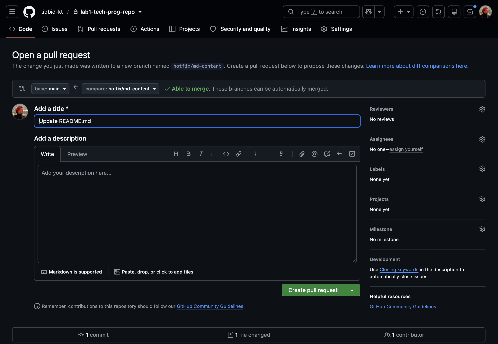
Предложение создать Pull Request

Пока PR **создавать не будем** — для этой лабы мержить научимся руками из командной строки.
В реальной работе через PR как раз обычно ревьюят и принимают изменения, так что просто имейте в виду, что такая штука существует.

Замечательно! Теперь в нашем удаленном репозитории есть ветка с нормальным описанием проекта. 
Однако хорошо бы эту ветку иметь локально. Давайте приведем состояния локального и удаленного репозитория в соответствие!

Забрать недостающие ветки из удаленного репозитория можно командой `git fetch`:

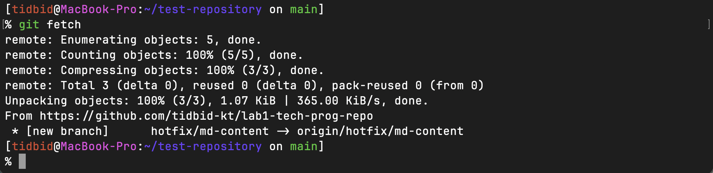
Забираем ветки с ремоута

Если не указывать `remote` с которого мы хотим забрать изменения (как это сделал я), 
то гит будет по умолчанию использовать `origin` (как удачно что ремоут именно с таким именем мы и добавили!!!).

Замечательно, теперь в нашем локальном репозитории есть ветка с хотфиксом. Встает вопрос, а как в нее попасть?
Для этого есть команда `git checkout`, в качестве аргумента укажем для нее `hotfix/md-content` - ту ветку, на которую хотим переключиться:

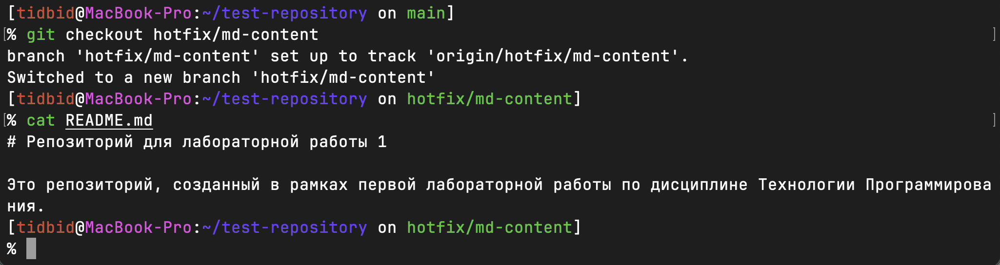
Переключаемся на ветку

Просто невероятно, но мы видим, что теперь наш файл наполнен описанием! Все потому, что мы ушли с ветки `main` 
и находимся на ветке `hotfix/md-content`, в которую и вносили изменения.

Это все, конечно, хорошо, но данное описание нам хотелось бы видеть и в `main` тоже. 

Вместо того чтобы копировать его через CNTRL + C и вставлять через CNTRL + V, давайте поступим хитрее и интегрируем изменения, сделанные в `hotfix/md-content` в ветку `main`.

Для этого нам нужно переключиться обратно в ветку `main` с помощью команды `git checkout` и выполнить команду 
`git merge`, в качестве аргумента для которой укажем `hotfix/md-content` - ветку, изменения из которой мерджим в `main`:

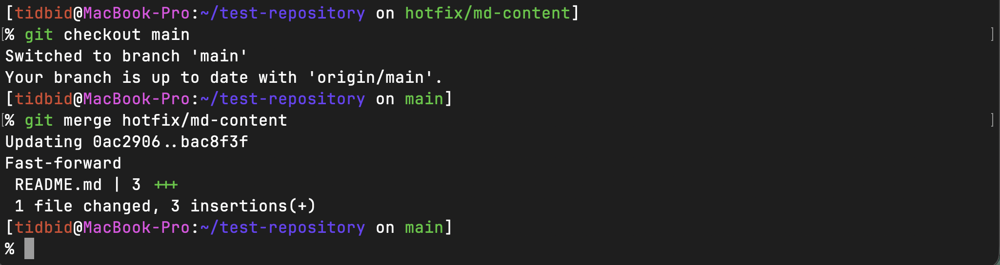
Сливаем ветки

`git merge` крайне интересная и сложная команда, однако базово нужно понимать следующее: 
при ее выполнении происходит слияние изменений из той ветки, которая указана как аргумент (в нашем случае из `hotfix/md-content`) 
в ту ветку, в которой вы находитесь (узнать ее можно через команду `git status`, в нашем случае это `main`).

Супер, изменения слиты, однако теперь получается, что в нашем локальном репозитории в ветке `main` 
содержимое файла это красивое описание проекта, а в удаленном репозитории - ещё старая версия (ведь мы слили ветки локально и еще не синхронизировали изменения)!!!

Давайте исправляться и пушить изменения в удаленный репозиторий. Это супер просто, выполняем команду `git push` и готово, даже аргументы не нужны:

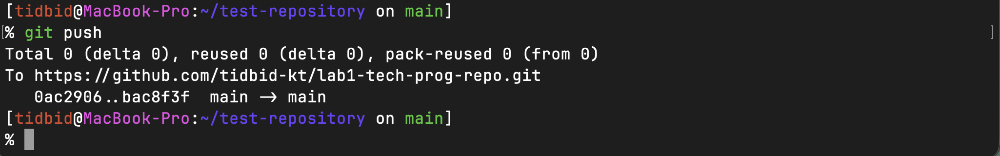
Пушим изменения

Указывать аргументы не надо, потому что гит и так понимает, куда надо пушить, 
ведь в самом начале мы прописали связь данной ветки с удаленной (см. пункт про синхронизацию локального и удаленного репозиториев).

Давайте проверять, что все прошло, заходим на GitHub и видим, всё на месте:

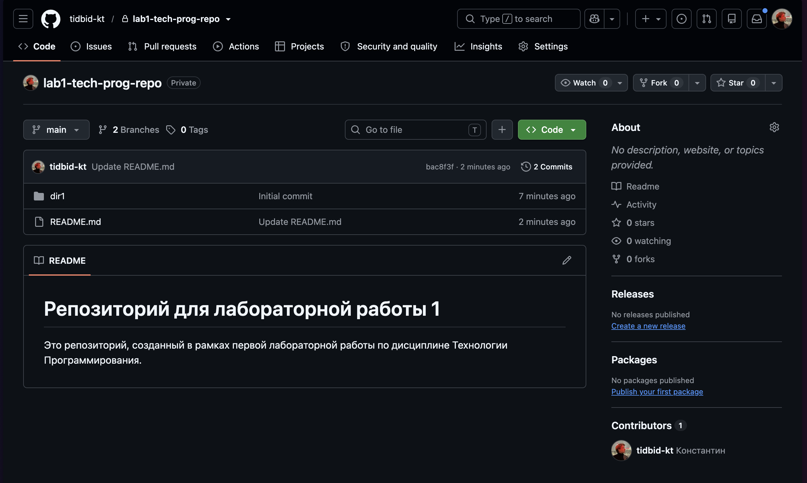
Отрыв всего

### Создание ветки локально

Замечательно, мы подходим к концу нашего базового экскурса в работу гита, на последок давайте создадим ветку сами, без использования веб технологий.

Для создания ветки используется команда `git checkout` с флагом `-b`:

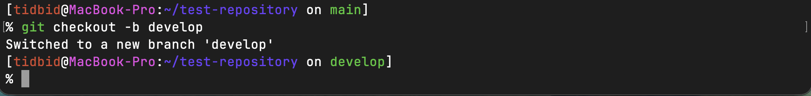
Создание ветки `develop`

Видим, что мы сразу же на нее и переключились. Удобно! Однако этой ветки пока нет в удаленном репозитории, опять же, давайте это исправлять.

В целом такое мы уже проделывали, нужно прописать `git push -u <remote_name> <remote_branch_name>`, то есть для нас это будет выглядеть вот так:

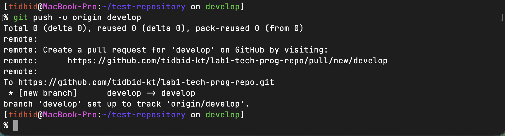
Отправляем новую ветку в облака

Теперь эта ветка появилась в удаленном репозитории, а локальная стала связана с ней (то есть `git push` для отправки изменений можно делать без аргументов). Список веток на GitHub:

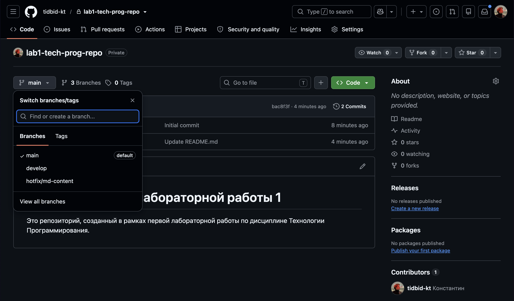
Ветки нашего проекта

### Стягивание удаленных изменений

Ну, на самом деле предыдущий раздел не был последним, забыли одну важную штуку. Представим, что в ваше отсутствие в ветку `develop` наделали изменений.

Симулировать это можно самим: в веб-интерфейсе переключаемся на `develop` и через кнопку **+** выбираем *Create new file*:

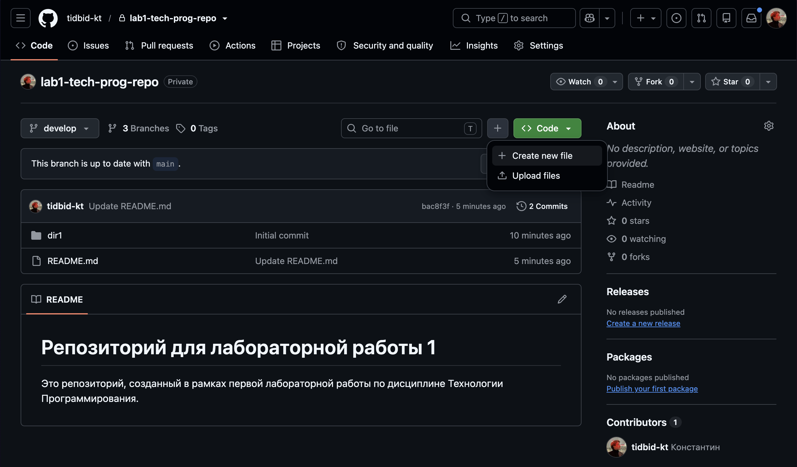
Create new file

Задаём имя файла (например `file-from-develop`) и любое содержимое:

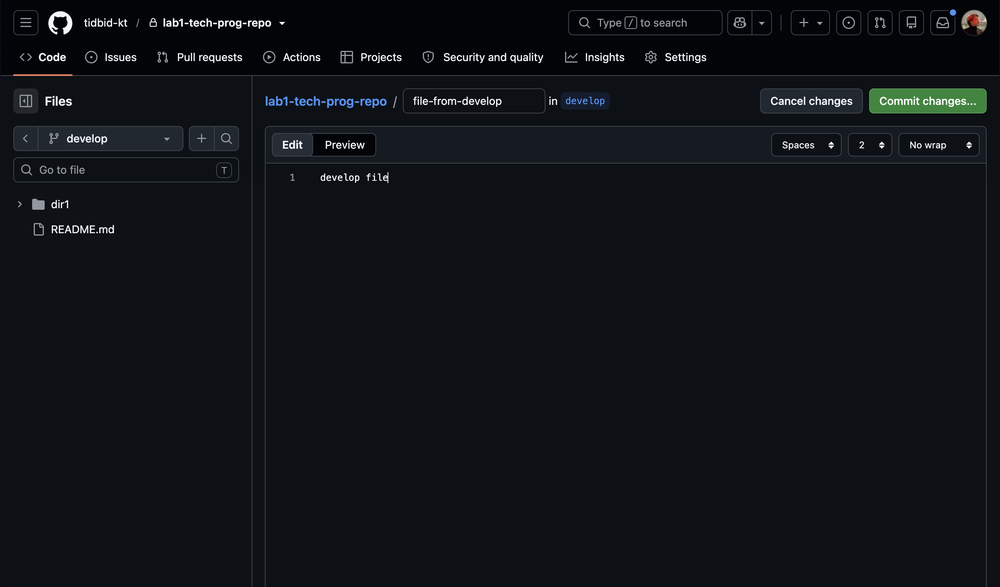
Пишем что-нибудь

Коммитим сразу в `develop`:

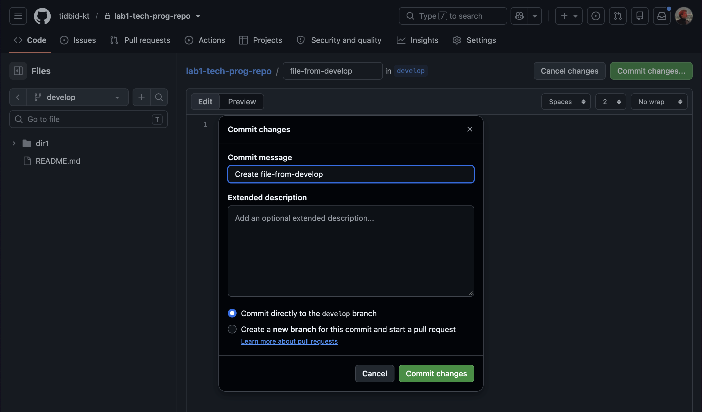
Коммитим в develop

Этих изменений в нашем локальном проекте ещё нет. Перейдём в ветку `develop` (помним про команду `git checkout`) и выполним `git status`:

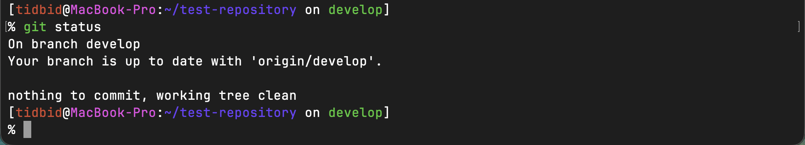
Состояние ветки `develop`

> **_NOTE:_** `git status` может написать, что локальная ветка *up to date* с `origin/develop`, даже если на GitHub уже есть новый коммит.
> Git просто еще не знает, что на remote что-то изменилось, а узнает когда будет сделан `git fetch`. После fetch `status` покажет, что вы отстали.
> `git pull` как раз сам делает fetch и подтягивает изменения в текущую ветку.

Так, чтобы забрать изменения, достаточно ~~простой советской~~ команды `git pull`:

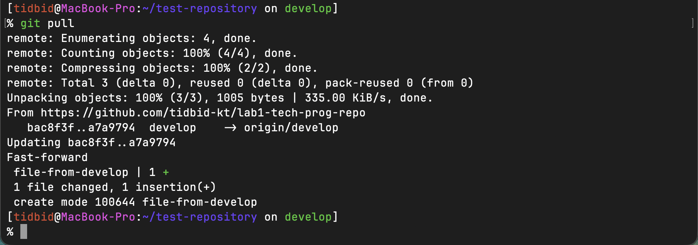
Пулл изменений

Замечательно, изменения у нас.

Ну вот, сейчас точно всё! Теперь вы умеете использовать базовые команды гита!!!

# Дополнительные материалы

Наиболее эффективный способ нормально научиться пользоваться гитом - практика, на пути к этому вам могут помочь следующие полезные ресурсы:

1. [Бесплатный большой курс от Хекслета](https://ru.hexlet.io/courses/intro_to_git) - обширный курс с хорошими практическими упражнениями
2. [Документация гита](https://git-scm.com/docs) - советую пользоваться по мере необходимости, читать про синтаксис команд, которыми пользуетесь
3. [Супер книжка про гит](https://git-scm.com/book/ru/v2) - здесь все, от базовых операций до того, как эта штука внутри работает, особенно интересно написано про объектное хранилище
